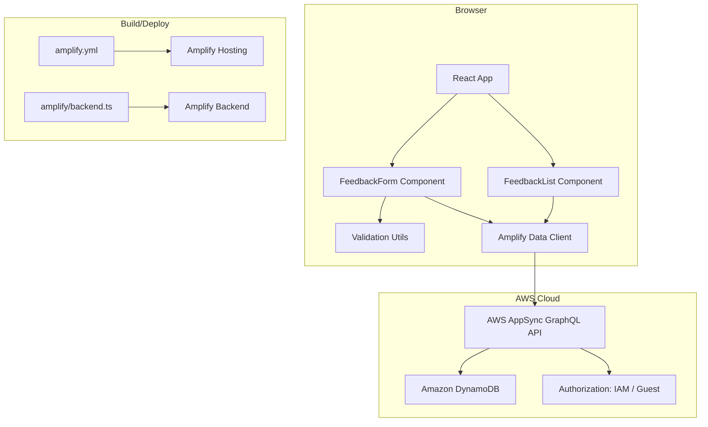

# Design Document

## Overview

The Workshop Feedback App is a single-page React application that allows workshop participants to submit and view feedback without authentication. It uses AWS Amplify Gen 2 for the backend data layer (AppSync + DynamoDB) and Amplify Hosting for deployment.

The app consists of two main areas on one page: a feedback submission form and a feedback list. The form collects a name, a 1–5 rating, and a comment. Submitted feedback is stored in DynamoDB via AppSync and displayed in reverse chronological order.

Key design decisions:
- **Guest/unauthenticated access**: Uses Amplify's `allow.guest()` authorization with IAM identity pool to avoid requiring user sign-up for a short workshop
- **Client-side validation + server-side enforcement**: Validation runs in the browser for UX, with schema-level constraints as a safety net
- **Optimistic list update**: After a successful save, the new entry is prepended to the local list without refetching all data

## Architecture



**Data flow:**
1. User fills out the feedback form
2. Client-side validation checks all fields
3. On submit, the Amplify Data client sends a `create` mutation to AppSync
4. AppSync enforces authorization (guest can create/read) and schema validation (rating 1–5)
5. DynamoDB stores the record with an auto-generated `createdAt` timestamp
6. On page load, the list component queries all feedback entries sorted by `createdAt` descending
7. After a successful create, the new item is prepended to the local state

## Components and Interfaces

### Project Structure

```
workshop-feedback-app/
├── .nvmrc                          # Node.js 20
├── amplify.yml                     # Amplify Hosting build config
├── amplify/
│   ├── backend.ts                  # Amplify backend definition
│   ├── auth/
│   │   └── resource.ts            # Auth config (guest access)
│   └── data/
│       └── resource.ts            # Data schema (Feedback model)
├── src/
│   ├── main.tsx                    # Entry point, Amplify.configure()
│   ├── App.tsx                     # Root layout
│   ├── components/
│   │   ├── FeedbackForm.tsx       # Form with validation
│   │   └── FeedbackList.tsx       # List display
│   └── utils/
│       └── validation.ts          # Pure validation functions
├── package.json
├── tsconfig.json
└── vite.config.ts
```

### Component Interfaces

#### `FeedbackForm`

```typescript
interface FeedbackFormProps {
  onFeedbackSubmitted: (entry: FeedbackEntry) => void;
}

interface FormState {
  name: string;
  rating: number | null;
  comment: string;
}

interface FormErrors {
  name?: string;
  rating?: string;
  comment?: string;
}
```

Responsibilities:
- Renders name input (text, maxLength 100), rating selector (1–5), comment textarea (maxLength 500)
- Runs client-side validation on change and on submit
- Disables submit button when any field is invalid or empty
- Shows saving indicator during the Amplify `create` call
- On success: clears fields, calls `onFeedbackSubmitted` with the created entry
- On failure: shows error message, preserves field values

#### `FeedbackList`

```typescript
interface FeedbackListProps {
  entries: FeedbackEntry[];
  isLoading: boolean;
  error: string | null;
}
```

Responsibilities:
- Displays a loading indicator while `isLoading` is true
- Shows an error message if `error` is set
- Shows an empty state message when `entries` is empty and not loading
- Renders each entry with name, rating (numeric 1–5), comment, and locale-formatted date
- Entries are ordered newest first (by `createdAt` descending)

#### `validation.ts` (Pure functions)

```typescript
function validateName(value: string): string | undefined;
function validateRating(value: number | null): string | undefined;
function validateComment(value: string): string | undefined;
function isFormValid(name: string, rating: number | null, comment: string): boolean;
```

Validation rules:
- `name`: must have ≥1 non-whitespace character, ≤100 total characters
- `rating`: must be an integer in [1, 5]
- `comment`: must have ≥1 non-whitespace character, ≤500 total characters
- Each returns `undefined` if valid, or an error message string if invalid

### App-Level State Management

The root `App` component manages the feedback entries list:
- On mount: fetches all entries from Amplify Data, sorted by `createdAt` descending
- Tracks loading and error states
- When `FeedbackForm` reports a successful submission, prepends the new entry to the local list

## Data Models

### Amplify Schema Definition (`amplify/data/resource.ts`)

```typescript
import { a, defineData, type ClientSchema } from '@aws-amplify/backend';

const schema = a.schema({
  Feedback: a.model({
    name: a.string().required(),
    rating: a.integer().required(),
    comment: a.string().required(),
  })
  .authorization(allow => [allow.guest()])
});

export type Schema = ClientSchema<typeof schema>;

export const data = defineData({
  schema,
  authorizationModes: {
    defaultAuthorizationMode: 'iam',
  },
});
```

### Auth Configuration (`amplify/auth/resource.ts`)

```typescript
import { defineAuth } from '@aws-amplify/backend';

export const auth = defineAuth({
  loginWith: {
    email: true,
  },
  // Guest access enabled for unauthenticated identity pool
});
```

### Generated Client Type

The Amplify codegen produces a typed client:

```typescript
// Usage in components
import { generateClient } from 'aws-amplify/data';
import type { Schema } from '../../amplify/data/resource';

const client = generateClient<Schema>();

// Create
const { data, errors } = await client.models.Feedback.create({
  name: 'Alice',
  rating: 5,
  comment: 'Great workshop!',
});

// List (sorted by createdAt descending)
const { data: entries, errors } = await client.models.Feedback.list({
  sortDirection: 'DESC',
});
```

### DynamoDB Table Structure

| Field     | Type     | Constraints                        |
|-----------|----------|------------------------------------|
| id        | String   | Auto-generated partition key       |
| name      | String   | Required, max 100 chars (client)   |
| rating    | Integer  | Required, 1–5 (client + server)    |
| comment   | String   | Required, max 500 chars (client)   |
| createdAt | DateTime | Auto-set by Amplify on creation    |
| updatedAt | DateTime | Auto-set by Amplify on mutation    |

### Authorization Rules

| Operation | Guest (Unauthenticated) |
|-----------|------------------------|
| Create    | ✅ Allowed             |
| Read      | ✅ Allowed             |
| Update    | ❌ Denied              |
| Delete    | ❌ Denied              |

Note: `allow.guest()` maps to Cognito Identity Pool unauthenticated role. The `defaultAuthorizationMode: 'iam'` ensures requests use IAM credentials from the identity pool.


## Correctness Properties

*A property is a characteristic or behavior that should hold true across all valid executions of a system — essentially, a formal statement about what the system should do. Properties serve as the bridge between human-readable specifications and machine-verifiable correctness guarantees.*

### Property 1: Text field validation accepts only valid inputs

*For any* string input to the name or comment field, the validation function SHALL accept the input if and only if it contains at least 1 non-whitespace character AND does not exceed the maximum length (100 for name, 500 for comment). Strings that are empty, whitespace-only, or exceed the max length SHALL be rejected.

**Validates: Requirements 4.1, 4.3**

### Property 2: Rating validation accepts only integers 1 through 5

*For any* numeric value, the rating validation function SHALL accept the value if and only if it is an integer in the inclusive range [1, 5]. All other values (null, undefined, floats, integers outside 1–5) SHALL be rejected.

**Validates: Requirements 2.2, 4.2**

### Property 3: Submit button enabled iff all fields are valid

*For any* combination of form field values (name, rating, comment), the submit button SHALL be enabled if and only if all three fields pass their respective validation rules. If any single field is invalid, the button SHALL be disabled.

**Validates: Requirements 4.5**

### Property 4: Successful submission clears form state

*For any* valid feedback entry that is successfully saved, the form state SHALL be reset to empty values (name = "", rating = null, comment = "") after the save completes.

**Validates: Requirements 3.4**

### Property 5: Failed submission preserves form state

*For any* valid feedback entry where the save operation fails, the form state SHALL retain all previously entered values (name, rating, comment) unchanged.

**Validates: Requirements 3.5**

### Property 6: Feedback entry display contains all required fields

*For any* feedback entry with name, rating, comment, and createdAt values, the rendered output SHALL contain the name string, the numeric rating value (1–5), the comment string, and a locale-formatted date/time string derived from createdAt.

**Validates: Requirements 5.3**

### Property 7: Feedback list ordering is newest first

*For any* list of feedback entries with distinct createdAt timestamps, the displayed order SHALL be strictly descending by createdAt (most recent entry first).

**Validates: Requirements 5.4**

## Error Handling

| Scenario | Handling Strategy |
|----------|-------------------|
| Form validation failure | Inline error messages next to each invalid field; submit button remains disabled |
| Network error on submit | Display error banner above form; preserve all field values for retry |
| AppSync mutation error | Parse error response; show user-friendly message; preserve field values |
| Network error on list fetch | Display error message in list area with suggestion to refresh |
| Empty list response | Show "No feedback has been submitted yet" message |
| Rating out of range (server) | AppSync schema rejects; client shows generic save error |
| Amplify configuration missing | App fails to initialize; console error logged |

### Error Message Guidelines
- User-facing messages are non-technical: "Unable to submit feedback. Please try again."
- Error messages for loading: "Unable to load feedback. Please refresh the page."
- Validation messages are field-specific: "Name is required", "Please select a rating", "Comment is required"
- No raw error objects or stack traces shown to users

## Testing Strategy

### Unit Tests (Example-Based)

Unit tests cover specific UI behaviors and integration points:

- **FeedbackForm rendering**: Verify all input fields render correctly (3.1)
- **Saving indicator**: Verify loading state shows during submit (3.3)
- **Validation messages**: Verify inline errors display next to invalid fields on submit attempt (4.4)
- **Loading indicator**: Verify spinner shows while list is fetching (5.2)
- **Error state**: Verify error message displays on fetch failure (5.5)
- **Empty state**: Verify empty message when no entries exist (5.6)
- **Optimistic update**: Verify new entry appears in list after submit (5.7)

### Property-Based Tests

Property-based tests use `fast-check` to validate universal correctness properties with randomized inputs. Each test runs a minimum of 100 iterations.

| Property | Test Description | Library |
|----------|-----------------|---------|
| Property 1 | Generate random strings; verify `validateName` and `validateComment` accept/reject correctly | fast-check |
| Property 2 | Generate random numbers (including edge cases); verify `validateRating` accept/reject correctly | fast-check |
| Property 3 | Generate random form states; verify `isFormValid` matches individual field validations | fast-check |
| Property 4 | Generate valid feedback entries; mock successful save; verify form resets | fast-check |
| Property 5 | Generate valid feedback entries; mock failed save; verify form values preserved | fast-check |
| Property 6 | Generate random feedback objects; render FeedbackList entry; verify all fields present | fast-check |
| Property 7 | Generate random lists of feedback entries with distinct timestamps; verify sort order | fast-check |

**Configuration:**
- Library: `fast-check` (TypeScript-native, integrates with Vitest)
- Test runner: Vitest
- Minimum iterations: 100 per property
- Tag format: `Feature: workshop-feedback-app, Property {N}: {description}`

### Integration Tests

- **Amplify Data create/read**: Verify round-trip save and fetch against sandbox (manual/CI)
- **Authorization**: Verify guest can create and read; verify update/delete are rejected
- **Node.js version enforcement**: Verify `npm install` fails on wrong Node version

### Smoke Tests

- `.nvmrc` file exists with content "20"
- `package.json` has correct `engines` field
- `amplify.yml` contains correct build commands
- App renders without errors in development mode
